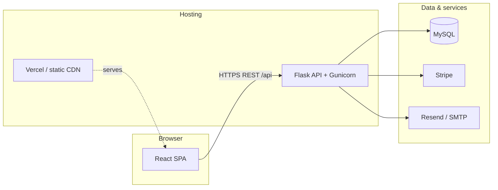

# Dream Health Foods — Full-Stack E-Commerce

[](https://github.com/sujalsahani1903/DreamHealth_cursor/actions/workflows/ci.yml)


Production-style **B2C e-commerce** for healthy grains, atta, millets, sattu, and custom nutrition mixes. Built as a portfolio-grade full-stack application with a modern storefront, REST API, role-based admin, payments, and operational tooling.

**Author:** [sujalsahani1903](https://github.com/sujalsahani1903)

---

## Highlights (for reviewers)

| Area | What it demonstrates |
|------|----------------------|
| **Auth** | JWT access + refresh, bcrypt passwords, email OTP (signup / forgot-password) |
| **Commerce** | Cart, wishlist, pack-size variants, Buy Now, COD + Stripe Checkout |
| **Orders** | Per-line-item fulfillment status, invoices, payment webhooks |
| **Admin** | Dashboard analytics, product CRUD with images, inventory, tabbed order management |
| **Ops** | Rate limiting, health check, env-based config, CI build pipeline |
| **UX** | Dark mode, responsive Tailwind UI, lazy routes, SEO meta tags |

---

## Feature overview

### Customer
- Browse shop by category, product detail with **pack sizes** (250g–5kg) and stock per variant
- **Add to cart** / **Buy now** (single-item checkout flow)
- Checkout with **Cash on Delivery** or **Stripe** online payment
- Order history with line-item status (pending → delivered)
- Wishlist, reviews, saved addresses, profile
- **Contact** page with WhatsApp CTAs for orders & enquiries

### Admin
- Revenue & product analytics (Recharts)
- Products: categories, variants, image upload
- Orders: filter by status, **per-item** ship/deliver, mark COD paid
- Inventory & raw-materials tracking

---

## Tech stack

| Layer | Technologies |
|-------|----------------|
| **Frontend** | React 18, Vite 5, Tailwind CSS, Framer Motion, React Router, Axios, react-hot-toast |
| **Backend** | Flask 3, SQLAlchemy, Flask-JWT-Extended, Flask-Bcrypt, Flask-Limiter, Gunicorn |
| **Database** | MySQL 8 |
| **Payments** | Stripe Checkout + webhooks; Cash on Delivery |
| **Email** | Resend API or SMTP (OTP & order confirmations) |

---

## Architecture



See [docs/ARCHITECTURE.md](docs/ARCHITECTURE.md) for routes, auth flow, and order lifecycle.

---

## Project structure

```
dream-health-foods/
├── frontend/          # React storefront + admin UI
├── backend/           # Flask REST API
├── database/          # schema.sql, seed.sql, migrations/
├── docs/              # Deployment & architecture guides
├── docker-compose.yml # Optional local MySQL
└── .github/workflows/ # CI (frontend build)
```

---

## Quick start (local)

### Prerequisites
- Node.js **18+**, Python **3.11+**, MySQL **8+**

### 1. Database

```bash
mysql -u root -p < database/schema.sql
mysql -u root -p < database/seed.sql
```

**Demo accounts** (password `Password123!`):

| Role | Email |
|------|--------|
| Admin | `admin@dreamhealthfoods.com` |
| Customer | `priya@example.com` |

Upgrading an existing DB? See [database/README.md](database/README.md).

### 2. Backend

```bash
cd backend
python -m venv .venv
.venv\Scripts\activate          # Windows
# source .venv/bin/activate     # macOS / Linux
pip install -r requirements.txt
copy .env.example .env          # edit DATABASE_URL, secrets
python app.py                   # http://127.0.0.1:5000
```

Health check: `GET http://127.0.0.1:5000/health`

### 3. Frontend

```bash
cd frontend
copy .env.example .env.local
npm install
npm run dev                     # http://localhost:5173
```

Leave `VITE_API_URL` empty in dev — Vite proxies `/api` to the Flask server.

### Optional: MySQL via Docker

```bash
docker compose up -d
# Then set DATABASE_URL in backend/.env to match docker-compose credentials
```

---

## Environment variables

### Backend (`backend/.env`)

| Variable | Purpose |
|----------|---------|
| `DATABASE_URL` | SQLAlchemy URI (`mysql+pymysql://...`) |
| `SECRET_KEY`, `JWT_SECRET_KEY` | App & token signing (use long random values in prod) |
| `FRONTEND_URL` | CORS origin(s), comma-separated |
| `STRIPE_SECRET_KEY`, `STRIPE_WEBHOOK_SECRET` | Online payments |
| `RESEND_API_KEY` or `MAIL_*` | OTP & transactional email |
| `ALLOW_PUBLIC_ADMIN` | `false` in production (blocks public admin signup) |
| `FLASK_ENV` | `production` on deployed API |

Full list: [backend/.env.example](backend/.env.example)

### Frontend (`frontend/.env.local`)

| Variable | Purpose |
|----------|---------|
| `VITE_API_URL` | Production API origin (e.g. `https://your-api.onrender.com`) |
| `VITE_STRIPE_PUBLISHABLE_KEY` | Optional, for future Stripe Elements |

---

## Deployment

| Stack | Guide |
|-------|--------|
| **Railway** (MySQL) + **Vercel** (API) + **Render** (storefront) | **[docs/DEPLOYMENT-FREE.md](docs/DEPLOYMENT-FREE.md)** |
| Vercel frontend + Render API (best for file uploads) | **[docs/DEPLOYMENT.md](docs/DEPLOYMENT.md)** |

**Before going live:**
1. Set strong `SECRET_KEY` / `JWT_SECRET_KEY`
2. Point Stripe webhook to `https://YOUR-API/api/payment/webhook`
3. Set `FRONTEND_URL` to your live storefront URL
4. Run `database/schema.sql` (and migrations if upgrading)

---

## API overview

| Group | Examples |
|-------|----------|
| Auth | `POST /api/auth/login`, `signup`, `refresh`, `addresses` |
| Catalog | `GET /api/products`, `GET /api/categories` |
| Cart | `GET/POST /api/cart`, `POST /api/cart/buy-now` |
| Orders | `POST /api/orders`, `GET /api/orders/my-orders` |
| Payments | `GET /api/payment/methods`, `POST /api/payment/create-checkout-session`, `POST /api/payment/cod`, `POST /api/payment/webhook` |
| Admin | `GET /api/admin/dashboard`, order & product management |

---

## Scripts

```bash
# Frontend
cd frontend && npm run dev && npm run build

# Backend
cd backend && python app.py
cd backend && gunicorn app:app --bind 0.0.0.0:5000
```

---

## Security

- Never commit `.env` files or real API keys (see [SECURITY.md](SECURITY.md))
- Passwords hashed with **bcrypt**; OTP stored as hashes with expiry
- Use **HTTPS** and unique secrets in production
- For multi-instance APIs, configure Flask-Limiter with **Redis**

---

## License

[MIT](LICENSE) — © 2026 [sujalsahani1903](https://github.com/sujalsahani1903). Business branding “Dream Health Foods” remains with the project owner.
