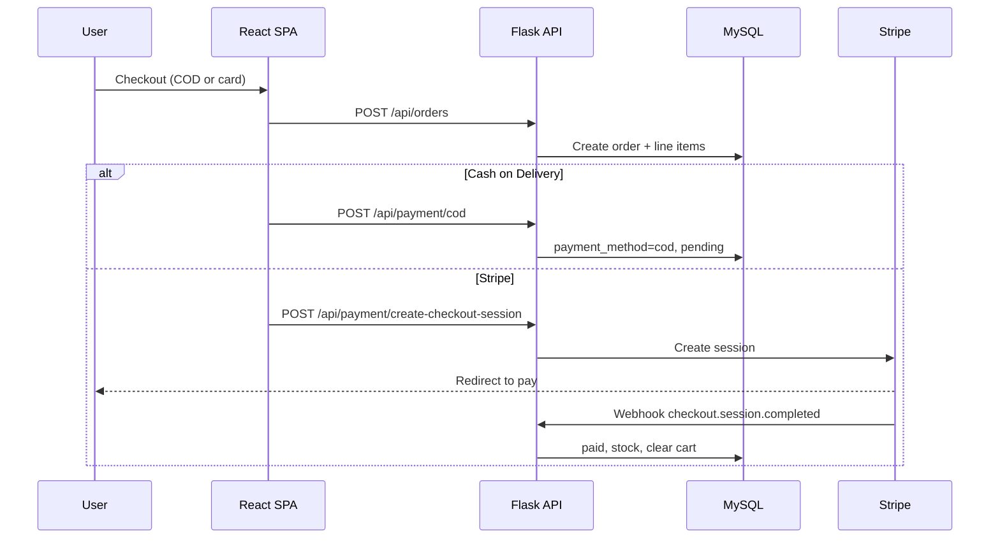

# Architecture

## Request flow (checkout)

## Authentication

- **Login:** email + password → JWT access (short) + refresh (long) tokens
- **Signup / forgot password:** OTP emailed → verified → account created or reset token issued
- Protected routes use `@jwt_required()`; admin routes check `role == admin`
- Frontend stores tokens in `localStorage`; Axios interceptor refreshes on 401

## Data model (core)

| Table | Role |
|-------|------|
| `users` | Customers & admins |
| `products` | Catalog items |
| `product_variants` | Pack size, price, stock per SKU |
| `cart_items` | `(user_id, variant_id)` unique |
| `orders` / `order_items` | Order header + lines with `item_status` |
| `transactions` | Payment records |
| `email_otps` | Hashed OTP for signup / reset |

## Order status sync

Each `order_items.item_status` can differ (one line shipped, another pending).  
`sync_order_status()` in `backend/utils/order_helpers.py` derives the parent `orders.status` from line states.

## File uploads

Admin product images upload to `backend/uploads/` and are served at `GET /uploads/<path>`.

## Frontend structure

- `src/pages/` — route-level views (lazy-loaded in `App.jsx`)
- `src/components/admin/` — admin panels
- `src/context/AuthContext.jsx` — auth state
- `src/services/api.js` — Axios instance + interceptors
- `src/config/contact.js` — business contact & WhatsApp URLs
